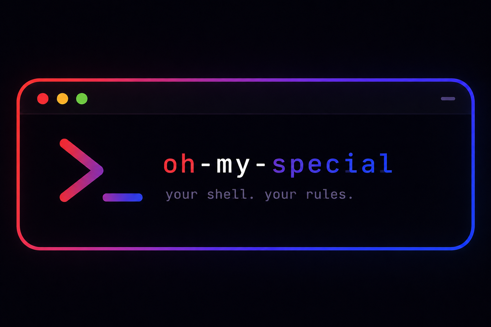

# 🚀 Oh-My-Special


A lightweight, extensible custom shell built in Python.  
Designed for learning how real terminal environments, command parsing, and system-level interactions work under the hood.

---

## 📌 Overview

**Oh-My-Special** is a Python-based mini shell that replicates core terminal behaviors such as navigation, command execution, and directory listing — with a focus on clarity, customization, and future extensibility.

It is not a replacement for CMD/PowerShell, but a learning-focused shell emulator.

---

## ✨ Features

- 🖥️ Custom CLI prompt system
- 📂 Directory navigation (`cd`)
- 📄 File listing (`ls`)
- 🎨 Colored terminal output (via `colorama`)
- ⚙️ Command parser system
- 🧠 Extensible command architecture (`Commands` class)
- 🔁 Interactive REPL loop (planned/active)

---

## 🧱 Project Structure

```text
oh-my-special/
│
├── main.py           # Entry point (REPL loop)
├── commands.py       # Command logic & execution
├── config.py         # Optional configuration (future)
└── README.md
